# GuardRail

Pre-execution security guards for AI coding agents.

<p align="center">
  
</p>

One command. Zero config. Every command your AI agent runs is guarded before it executes.

```bash
npx guardrail-agent init
```

Derived from **100+ production guards running across 15 applications**.
These are the patterns that actually stop incidents.

## Why

Your AI coding agent runs commands on your machine. It can delete files, push
to production, leak secrets, and drop database tables. Most tools catch
problems *after* they happen. GuardRail catches them *before*.

Real example from our production system: an AI agent ran
`git reset --hard` during a debugging session, wiping 3 hours of uncommitted
work. Another tried `docker exec postgres psql -c "DELETE FROM profiles"` --
no WHERE clause. Both blocked by GuardRail before they executed.

## 10 Core Guards (MIT, free forever)

| Guard | What it stops |
|---|---|
| `main_push_guard` | Force push, direct push to main/master, `reset --hard`, `clean -f` |
| `basic_pii_gate` | `env`, `printenv`, `docker inspect`, `/proc/environ` -- anything that dumps secrets |
| `basic_secret_detector` | `curl webhook.site`, sending `$API_KEY` via POST, base64 exfiltration |
| `destructive_path_guard` | `rm -rf` on /home, /etc, /var, /opt -- configurable protected paths |
| `firewall_flush_guard` | `iptables -F`, `ufw disable`, `nft flush ruleset` |
| `service_protection_guard` | `systemctl stop docker`, `killall postgres`, `pkill sshd` |
| `mass_update_guard` | `UPDATE profiles SET ...` or `DELETE FROM users` without WHERE clause |
| `env_dump_detector` | Catches environment dumps in command *output* (even from obfuscated commands) |
| `basic_injection_scanner` | Detects "ignore previous instructions" and role-override injections in output |
| `error_swallow_guard` | Flags empty catch blocks in payment/webhook/cron code |

Every guard is configurable. Every block is logged. Every log has a timestamp.

## GuardRail Pro

48 advanced guards from real production incidents. The attacks that basic
pattern matching misses.

| What Pro catches | Why it matters |
|---|---|
| Script content analysis | Agent writes payload to file, then runs the file -- bypasses command-line guards |
| Multi-step attack detection | Credential scan followed by network exfiltration -- blocked on the second step |
| Self-bypass prevention | Agent tries to delete its own gate files or create approval tokens |
| Supply chain audit | `npm install` with known-vulnerable or restrictively-licensed packages |
| EU AI Act compliance | Guard-to-article mapping, PDF audit reports for regulators |

Plus: PEN-test framework (50+ attack patterns), priority support, compliance kit.

**EUR 20/dev/month** | [Get started](https://guardrail.promptandbuild.de)

## Configuration

After installation, customize `~/.claude/hooks/guardrail/guardrail.config.sh`:

```bash
# Protected database tables
GUARDRAIL_PROTECTED_TABLES="auth.users profiles members"

# Protected git branches
GUARDRAIL_PROTECTED_BRANCHES="main master production"

# Critical services
GUARDRAIL_CRITICAL_SERVICES="docker sshd traefik postgresql nginx"

# Strict mode (true = block, false = warn only)
GUARDRAIL_STRICT_MODE="true"
```

## Custom Guards

Create your own in `~/.claude/hooks/guardrail/guards/custom/`:

```bash
guardrail new block_npm_global
```

This generates a guard template with a matching test file. Edit the pattern,
run the test, done. The guard loads automatically on the next command.

## CLI

```
$ guardrail status

  GuardRail v0.2.2

  10 core guards active
  0 pro guards

  Audit: 47 blocked / 312 total

$ guardrail pentest

  Phase 3: Attack Simulation
  x BLOCKED push to main
  x BLOCKED force push
  + ALLOWED push develop (FP)
  x BLOCKED rm -rf /etc
  + ALLOWED rm single file (FP)

  All 22 tests passed.
```

## How It Works

```
AI Agent (Claude Code)
      |
      v
[Pre-Bash Dispatcher]     Before the command runs
      |
   [Guards] ------------- BLOCKED  (command never executes)
      |                   WARNED   (executes with context)
      v
[Command Executes]
      |
      v
[Post-Bash Dispatcher]    After the command runs
      |
   [Output Scanners] ----- Injection detection, env dump detection
```

Guards are bash functions. No runtime dependencies beyond bash and jq.
Works on Linux and macOS. Installs in 5 seconds.

## EU AI Act

EU AI Act enforcement starts **August 2, 2026**. If you use AI coding agents
in the EU, you need governance tooling. GuardRail provides:

| Article | Requirement | How GuardRail helps |
|---|---|---|
| Art. 9 | Risk management | Guard classification, PEN-test framework |
| Art. 14 | Human oversight | deny() gates with admin approval workflows |
| Art. 12 | Record-keeping | Timestamped audit log, exportable |

Full compliance mapping with PDF export available in GuardRail Pro.

## Works with

**Claude Code** -- native hook support, zero config.
Cursor, GitHub Copilot, Windsurf support planned.

## Requirements

- bash 4+, jq
- Linux or macOS

## License

MIT. See [LICENSE](LICENSE).

---

Built by [Prompt & Build](https://promptandbuild.de).
Patterns extracted from production systems running 100+ guards across 15 applications since 2025.
